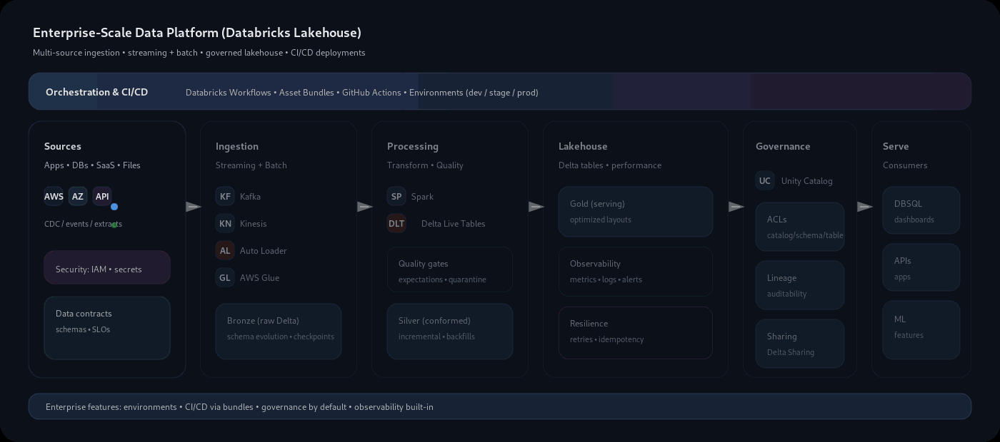

<h2>Sai Prasad Padhy</h2>

<b>Data Engineer</b> • Streaming & Lakehouse Systems • Cloud Native

  

  <a href="https://www.linkedin.com/in/saiprasadpadhy/">LinkedIn</a> •
  <a href="https://twitter.com/sai955000">Twitter</a> •
  <a href="https://projects.saiprasadpadhy.in">Portfolio</a>

---

## 👋 About

I build data platforms that are reliable, observable, and scalable.
Most of my work sits at the intersection of streaming, Spark, Databricks, and governed lakehouse patterns.

---

## 🧱 Stack

---

## 🗺️ Architecture I Build

  

  Databricks Workflows + Asset Bundles orchestrate Auto Loader / Kafka / Kinesis ingestion → Delta (Bronze/Silver/Gold) → Unity Catalog governed access.

---

## 🧠 Design Principles

<table>
  <tr>
    <td width="33%"><b>Reliability</b> Fail loudly. No silent data loss.</td>
    <td width="33%"><b>Scalability</b> Scale by design, not brute force.</td>
    <td width="33%"><b>Governance</b> Access, lineage, and schema are first-class.</td>
  </tr>
</table>

---

## ✍️ Writing

<!-- BLOG-POST-LIST:START -->
- Blog posts will appear here automatically
<!-- BLOG-POST-LIST:END -->

---

## 🐍 Contribution Snake

  

